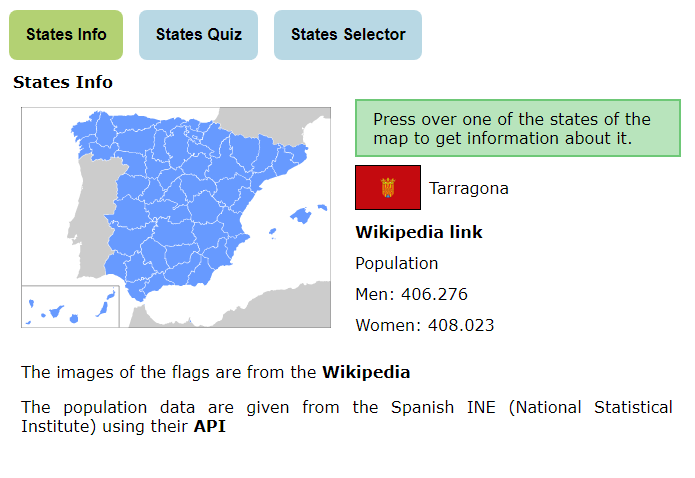
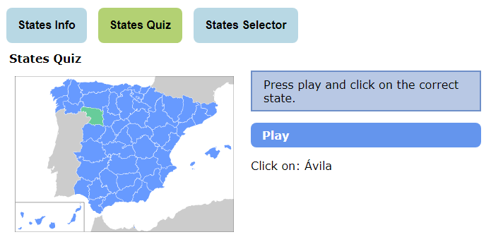
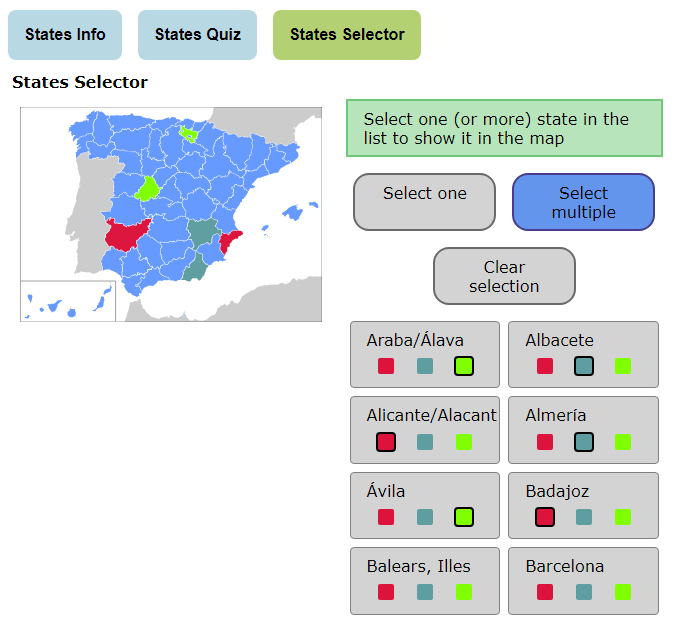

# States map component and demo

This repository includes:

* A component to include a states map of Spain to click over them and execute some action, or mark them are selected.

* A demo with three applications as examples how to use the component.

[README.md file of the component](projects/states-map/README.md)

---

Este repositorio incluye:

* Un componente para insertar un mapa con las provincias de España para clickar sobre estas y ejecutar alguna acción, o marcarlas como seleccionadas.

* Una demo con tres aplicaciones de ejemplo sobre como usar el componente.

[fichero README.md del componente](projects/states-map/README.md)

## States Info

In this application you can click over some state and get information about it.

---

En esta aplicación puede pulsar sobre una provincia y obtener información.

---

## States Quiz

This application is a little game to guess where is the state chosen randomly.

---

Esta aplicación es un pequeño juego para adivinar la provincia elegida al azar.

---

## States Selector

This application permits select one or more states and show the selection in the map.

---

Esta aplicación permite seleccionar una o más provincias y mostrar la selección en el mapa.

---

## Execute the demo

After cloning the repository you can go to the folder where the files are located and execute this:

`ng serve`

or 

`npm start`

After the process is finish and the server started, start a navigator and put this url:

`http://localhost:4200`

---

## Ejecutar la demo

Después de clonar el repositorio ha de dirigirse a la carpeta donde se alojen los ficheros y ejecutar:

`ng serve`

o 

`npm start`

Después de finalizar el proceso e iniciar el servidor, inicie el navegador e introduzca esta url:

`http://localhost:4200`

---

## Live demo

For a live demo of the component try next link:

---

Para una demostración del component, pulse sobre el siguiente enlace:

[Live demo](https://www.guitxo.com/componente-con-mapa-de-provincias-de-espana-y-demo-de-uso/)
