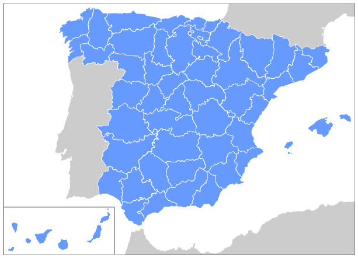

# StatesMap

This library includes a SVG image with a map of the Spain provinces.

The user can interact with the provinces clicking over them or marking them as selected.

---

Esta librería incluye una imagen SVG con un mapa de las provincias de España

El usuario puede interactuar con las provincias pulsando sobre ellas o marcandolas como seleccionadas.

---

## Code scaffolding

Run `ng generate component component-name --project states-map` to generate a new component. You can also use `ng generate directive|pipe|service|class|guard|interface|enum|module --project states-map`.
> Note: Don't forget to add `--project states-map` or else it will be added to the default project in your `angular.json` file. 

## Build

Run `ng build states-map` to build the project. The build artifacts will be stored in the `dist/` directory.

## Publishing

After building your library with `ng build states-map`, go to the dist folder `cd dist/states-map` and run `npm publish`.

## Running unit tests

Run `ng test states-map` to execute the unit tests via [Karma](https://karma-runner.github.io).

## Further help

To get more help on the Angular CLI use `ng help` or go check out the [Angular CLI README](https://github.com/angular/angular-cli/blob/master/README.md).
